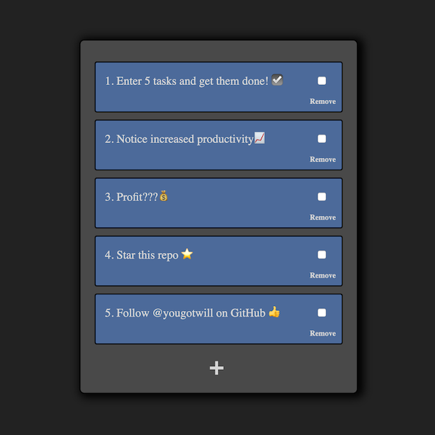

# Todo Box

## Description

A minimalist todo list app designed for you to get stuff done!

Every front-end developer makes a todo list at some point in their life. This is mine. I was learning vanilla javascript at the time. Not perfect code but perfect for beginners to get a good look at.

Currently I use this at my day job to keep track of my tasks for the day. No deadlines, no overwhelming feelings, just the basics.

### How to use

1. Enter **5 tasks** and get them done! ☑️
2. Notice increased productivity📈
3. Profit???💰
4. Star this repo ⭐️
5. Follow [@yougotwill](https://github.com/yougotwill) on GitHub 👍

### Features

- [x] Add, edit, and delete tasks.
- [x] Responsive Design
- [x] Dark Theme
- [x] Keyboard shortcuts
- [x] Minimalist
- [x] Works in any modern browser
- [x] Open-source

### Keyboard Shortcuts

| Windows / Linux        | macOS                   | Action                    |
| ---------------------- | ----------------------- | ------------------------- |
| <kbd>Shift+Alt+A</kbd> | <kbd>Ctrl+Shift+A</kbd> | Add task                  |
| <kbd>Shift+Alt+E</kbd> | <kbd>Ctrl+Shift+E</kbd> | Edit most recent task     |
| <kbd>Shift+Alt+R</kbd> | <kbd>Ctrl+Shift+R</kbd> | Remove most recent task   |
| <kbd>Shift+Alt+C</kbd> | <kbd>Ctrl+Shift+C</kbd> | Complete most recent task |

### Screenshot

## Development

### Installation

1. Make sure you've installed all requirements
2. Clone this repository:
   `git clone https://github.com/yougotwill/todo-box`

### Usage

Here's a short explanation how to use `todo-box`:

1. `cd` into the repository
2. Run `npm install`.
3. Do some JavaScript in [script.js](src/js/script.js) and save.
4. Open [index.html](src/index.html) in your browser of choice and see the results.

### Contributing

1. Fork it
2. Create your feature branch: `git checkout -b feature/my-new-feature`
3. Commit your changes: `git commit -am 'Add some feature'`
4. Push to the branch: `git push origin feature/my-new-feature`
5. Submit a pull request

### Requirements / Dependencies

- NodeJS
- npm
- SASS

### Version

0.1.0

## License

[MIT](LICENSE)
